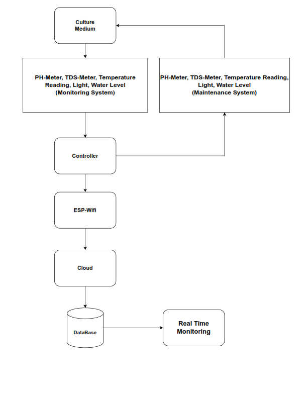

# AlProtein
AlProtein is a biotech startup producing innovative desirable non-meat alternative protein products from a mix of organic high-quality superfood with great nutritional values. Our protein mix is extracted from plant/algae aquacultures using our full-stack next-gen AI-optimized and automated protein production platform that is built on a sustainable water-integrated system that reuses every drop of water and nutrients. We are distributing food-tech conventional protein production with affordable, flavorful and nutritious products.

## Work Flow

The block diagram of the entire system. The culturing device has two main parts: the culturing system and the dashboard application which communicates through a cloud server. The culturing system is responsible for the monitoring and maintenance of the parameters. Monitoring includes temperature, pH, and TDS sensors. Data from the measured parameters will be sent to the Arduino and if the values of the parameters are out of the desired range, maintenance takes place by correcting the parameters. The Arduino opens or closes maintenance through a relay. The Arduino is also connected to the ESP-Wifi communication module which is responsible for sending data to the cloud. Accordingly, the dashboard updates its visuals and graphs depending on the updated data and its analysis. The application also can decide actions to be taken for the real-time monitoring in addition to the automatic control of the system programmed by the Arduino. These actions get communicated back to the arduino as well through the cloud and the communication module.

