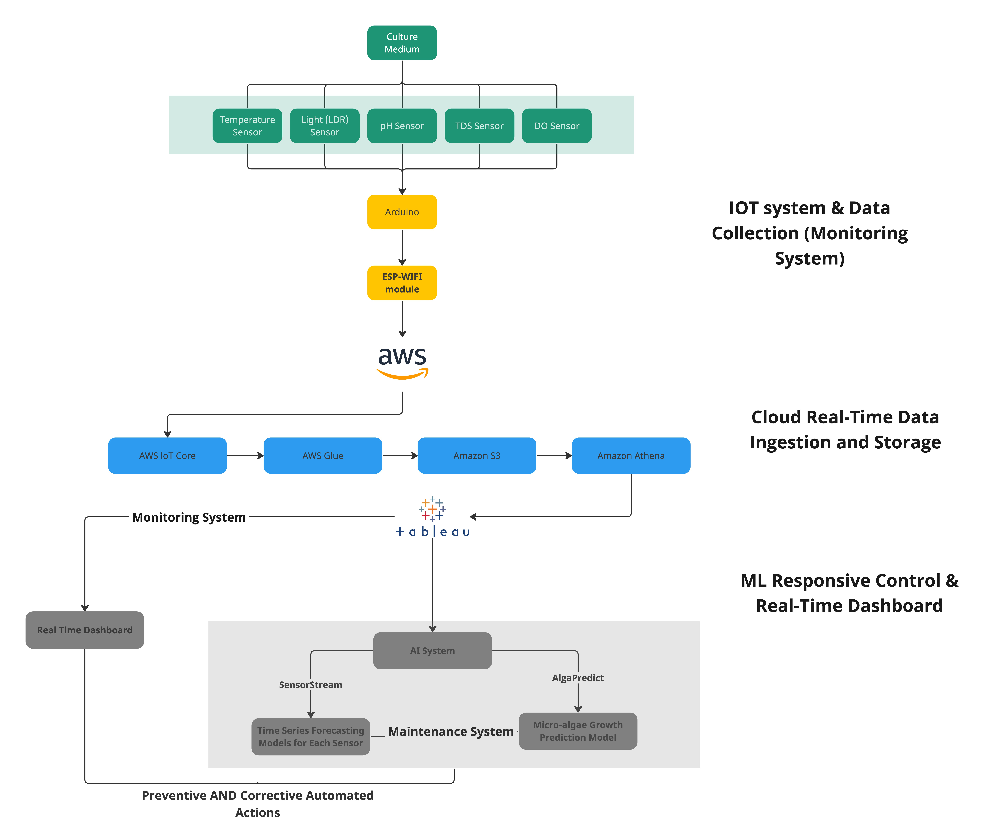

# AlProtein
AlProtein is a biotech startup producing innovative desirable non-meat alternative protein products from a mix of organic high-quality superfood with great nutritional values. Our protein mix is extracted from plant/algae aquacultures using our full-stack next-gen AI-optimized and automated protein production platform that is built on a sustainable water-integrated system that reuses every drop of water and nutrients. We are distributing food-tech conventional protein production with affordable, flavorful and nutritious products.

## Work Flow

